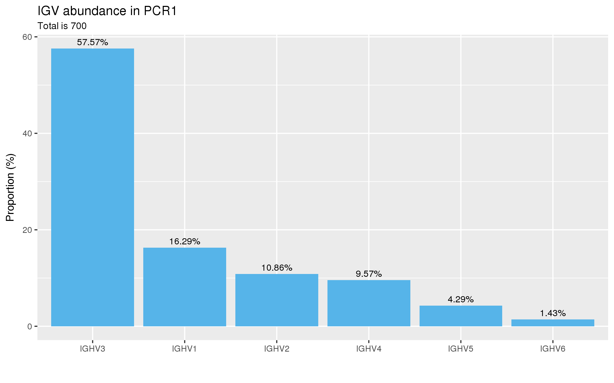
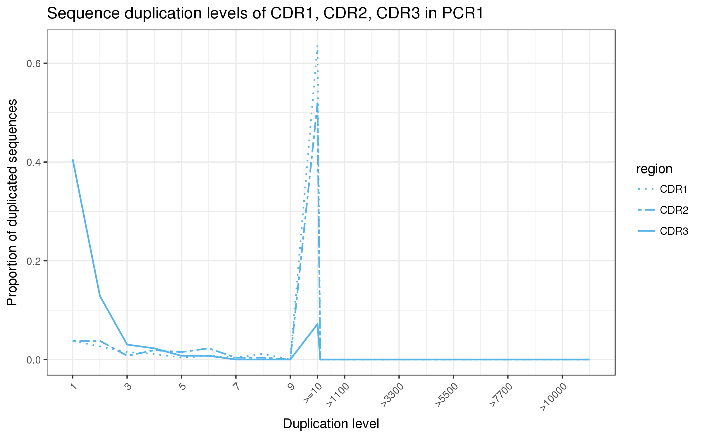
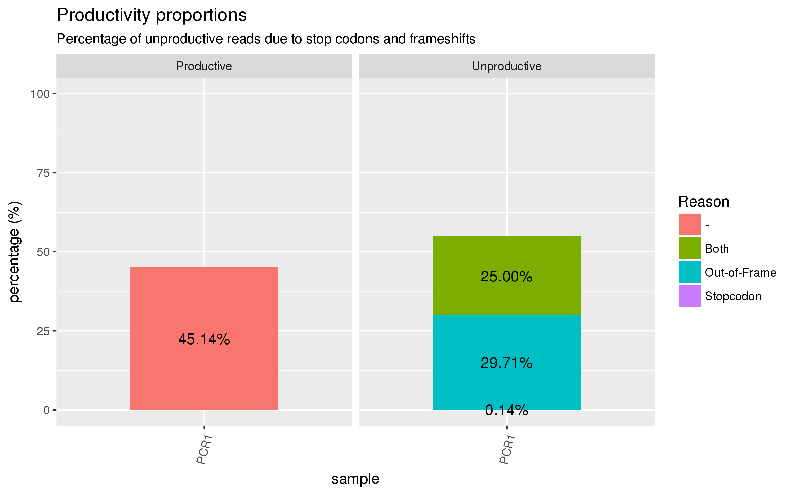

# abseqR

`abseqR` is part of the `AbSeq` pipeline - a comprehensive bioinformatic pipeline that
validates the quality of antibody libraries using next-generation sequencing technologies.


`abseqR` extends [`abseqPy`](https://github.com/malhamdoosh/abseqPy) by
plotting each corresponding data file generated by `abseqPy` and
collating them into an HTML report for convenient viewing and sharing.
Additionally, `abseqR` makes it possible to __compare__ multiple
`abseqPy` analyses.

Note that `abseqR` does not need `abseqPy` to be installed for it to function,
however, the output of `abseqPy` must already be present.


# Installation

## System requisites

[pandoc](http://pandoc.org/installing.html) is highly
recommended. If `abseqR` fails to detect `pandoc` on your
system's `PATH`, it will not collate the results/plots and present
them in a neat HTML document.

> Make sure `pandoc` is at least version 1.19.2.1


## Using Bioconductor

As soon as `abseqR` is available on [Bioconductor](http://bioconductor.org/):
```r
if (!require("BiocManager"))
    install.packages("BiocManager")
BiocManager::install("abseqR")
```

## Using GitHub

It is also possible to download `abseqR` from GitHub via `devtools`:
```r
if (!require("devtools"))
    install.packages("devtools")
devtools::install_github("malhamdoosh/abseqR")
```

# Usage

Assuming `abseqPy` has completed an analysis and the output directory was
named `output`, a basic usage of `abseqR` is:

```r
library(abseqR)
abseqReport("/path/to/output")
```

Please refer to the package vignette for more advanced use cases.


# Features

`abseqR` generates numerous plots for antibody repertoire quality control analysis
and collates the results into an HTML file. Here are some examples
to whet your appetite:

<br/>
<br/>

|
:-------------------------:|:-------------------------:
 | 
__V-(D)-J germline abundance__ | __Diversity estimation__

<br/>
<br/>

|
:-------------------------:|:-------------------------:
 | 
__Productivity analysis__ | __Clonotype analysis__

<br/>
<br/>

Plenty more plots and their documentation can be found in `abseqR`'s vignette.

In R, enter:

```r
browseVignettes("abseqR")
```
