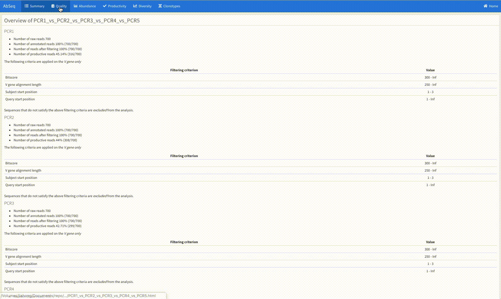

# abseqR: reporting functions and downstream analysis of antibody libraries Rep-Seq

`AbSeq` is a comprehensive bioinformatic pipeline for the analysis of sequencing datasets generated from antibody libraries and `abseqR` is one of its packages.


`abseqR` empowers the users of [`abseqPy`](https://github.com/malhamdoosh/abseqPy) with
plotting and reporting capabilities and
allows them to generate interactive HTML reports for the convenience of viewing and sharing with other researchers. Additionally, `abseqR` extends `abseqPy` to __compare__ multiple
repertoire analyses and perform further downstream analysis on its output.

Note that `abseqR` does not require `abseqPy` to be installed to work but the output of `abseqPy` must be already present to invoke `abseqR`'s functions.

## Developers

- AbSeq is developed by JiaHong Fong and Monther Alhamdoosh

- For comments and suggestions, email jiahfong \<at\> gmail \<dot\> com

## Installation

### System requirements

[pandoc](http://pandoc.org/installing.html) is highly
recommended. If `abseqR` fails to detect `pandoc` in your
system's `PATH` variable, it will not be able to generate a collated HTML report yet you can still access individual plots.

> Make sure `pandoc` is at least version 1.19.2.1

### Installation

#### Install from Bioconductor

As soon as `abseqR` is available in the [Bioconductor](http://bioconductor.org/) project, it can be installed from R console as follows:
```r
if (!require("BiocManager"))
    install.packages("BiocManager")
BiocManager::install("abseqR")
```

#### Install from GitHub

It is also possible to directly install `abseqR` from GitHub via `devtools` by running the following commands in R Console:
```r
if (!require("devtools"))
    install.packages("devtools")
devtools::install_github("malhamdoosh/abseqR")
```

## Quick start

Assuming `abseqPy` has completed an analysis and the output directory was
named `output`, a basic usage of `abseqR` is:

```r
library(abseqR)
abseqReport("/path/to/output")
```

This will generate an interctive report of the analysis results. Please refer to the package's main vignette for more advanced use cases.


## Features

`abseqR` generates numerous plots for the quality control analysis of antibody libraries
and collates the results into an interactive HTML report.



Additional plots along with documentation can be found in `abseqR`'s main vignette.

In R console, type:

```r
browseVignettes("abseqR")
```
